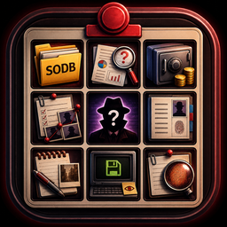

<p align="center">
  
</p>

<h1 align="center">Shadows of Doubt — SODB Save Editor</h1>

<p align="center">
  <b>Неофициальный save editor / viewer для сохранений <i>Shadows of Doubt</i>.</b><br>
  Распаковка <code>.sodb</code>, просмотр кейсов, людей, паролей, убийц/криминалов, предметов, адресов/комнат и аккуратное редактирование базовых параметров игрока.
</p>

<p align="center">
  
  
  
  
</p>

---

## О проекте

**SODB Save Editor** — небольшая GUI-утилита для работы с файлами сохранений `Shadows of Doubt`:

```text
.sodb  →  JSON  →  анализ / редактирование  →  .sodb
```

Программа ориентирована на удобный просмотр сейва без ручного копания в огромном JSON: кейсы, жители, связи, пароли, убийцы, криминальные флаги и основные параметры игрока выводятся в отдельных вкладках.

> [!WARNING]
> Это **неофициальный фанатский инструмент**. Он не связан с ColePowered Games, Fireshine Games или Steam. Перед перезаписью сохранения всегда делай бэкап.

## Оригинальная игра

- **Игра:** [Shadows of Doubt в Steam](https://store.steampowered.com/app/986130/Shadows_of_Doubt/)
- **Официальная страница:** [colepowered.com/games/shadows-of-doubt](https://colepowered.com/games/shadows-of-doubt/)
- **Разработчик:** [ColePowered Games](https://colepowered.com/)
- **Издатель:** [Fireshine Games](https://fireshinegames.co.uk/games/)

## Возможности

### Сейвы и JSON

- открытие `.sodb` сохранений;
- поддержка несжатых JSON-сейвов, если в игре отключено сжатие сохранений;
- распаковка Brotli-сжатого сейва с `4-byte size trailer`;
- просмотр Raw JSON прямо в программе;
- экспорт распакованного JSON;
- сохранение обратно в `.sodb`;
- `Backup + overwrite` для безопасной перезаписи исходного сейва;
- автобэкапы с timestamp в папке `backups/<имя_сейва>/`;
- валидатор сейва перед сохранением: структура JSON, passcodes, ссылки на citizens/rooms, roundtrip encode/decode.

### Игровые данные

- обзор сейва: город, время, билд, количество жителей, evidence, rooms, companies и т.д.;
- редактирование `money`, `lockpicks`, `socCredit`;
- редактирование статов `health`, `nourishment`, `hydration`, `energy`, `hygiene`;
- вкладка **Кейсы**: активные дела, цели, готовые ответы/resolveQuestions, места, жертвы/убийцы и связанные ID;
- вкладка **Люди / связи**: все citizens, HumanID, имена, работа, цель, координаты, связи и полная карточка человека;
- вкладка **Пароли**: найденные `passcodes`, поиск по имени/HumanID/коду/комнате;
- вкладка **Убийцы / криминалы**: текущие и исторические данные по убийствам, жертвы, оружие, preset/MO;
- вкладка **Граф связей**: визуализация связей между citizens по `sightingCit`, `keyTies`, общим roster и murder links;
- вкладка **Поиск evidence/interactables**: расширенный поиск по evidence и объектам мира;
- вкладка **Предметы / где лежит**: поиск interactables, владельца, RoomID, адреса, координат, locked/passcode;
- вкладка **Адреса / комнаты**: адресная книга RoomID → LocationID/address hints, жильцы, компании, пароли комнат;
- вкладка **Компании / работы**: CompanyRoster, сотрудники, роли и продажи;
- экспорт таблиц в CSV;
- автоматическое уточнение RoomID через известные связи room → address;
- увеличенное стартовое окно, горизонтальные скроллы и автоподбор ширины колонок;
- JSON path editor для точечного просмотра/изменения значений;
- кнопки **Очистить**, **Сбросить правки**, **?** со справкой.

## Установка и запуск из исходников

Требования:

- Windows 10/11;
- Python 3.10+;
- `brotli` из `requirements.txt`.

```bat
python -m pip install -r requirements.txt
python sod_save_editor.py
```

Или двойным кликом:

```text
run_sod_save_editor.bat
```

## Сборка одного EXE

В репозитории есть готовый скрипт:

```bat
build_exe.bat
```

Он устанавливает зависимости для сборки и запускает PyInstaller через модуль Python:

```bat
python -m PyInstaller --onefile --windowed --name "SODB_Save_Editor" --icon "icon.ico" sod_save_editor.py
```

Готовый файл появится здесь:

```text
dist\SODB_Save_Editor.exe
```

## Где лежат сохранения Shadows of Doubt

Обычно сейвы находятся здесь:

```text
%USERPROFILE%\AppData\LocalLow\ColePowered Games\Shadows of Doubt\Save
```

Перед редактированием лучше закрыть игру. После изменения сейва используй `Backup + overwrite`, чтобы рядом появился `.bak`.

## Что важно знать про пароли

Вкладка **Пароли** показывает `passcodes`, которые реально есть в сейве. Это **не гарантирует**, что там уже лежат пароли абсолютно всех жителей города.

Обычно:

```text
type=0  → личный код человека / HumanID
type=1  → код комнаты или локации
```

Если у человека нет личного `type=0` passcode, программа может показать, что пароль не найден. В таком случае можно вручную добавить пароль для HumanID, но это уже изменение сейва, а не извлечение «настоящего» кода.

## Безопасность

- Не редактируй сейв, пока он открыт игрой.
- Перед `overwrite` всегда делай бэкап. В v6 это делается автоматически в `backups/<имя_сейва>/`.
- Не открывай сейвы из непонятных источников, если не доверяешь файлу.
- Структура сейвов игры не документирована официально, поэтому часть полей может меняться между версиями игры.

## Структура репозитория

```text
.
├── .github/workflows/build-windows.yml   # GitHub Actions: сборка EXE
├── assets/icon.png                       # иконка для README
├── docs/SAVE_FORMAT.md                   # заметки по формату .sodb
├── build_exe.bat                         # локальная сборка Windows EXE
├── icon.ico                              # иконка для EXE
├── requirements.txt                      # runtime-зависимости
├── requirements-dev.txt                  # зависимости для сборки
├── run_sod_save_editor.bat               # запуск из исходников на Windows
└── sod_save_editor.py                    # основной код приложения
```

## Roadmap

- [x] Более красивый граф связей между citizens.
- [x] Экспорт таблиц в CSV.
- [x] Расширенный поиск по evidence/interactables.
- [x] Автоматическое определение адресов/комнат по RoomID.
- [x] Отдельная вкладка для компаний и рабочих мест.
- [x] Валидатор сейва.
- [x] Автобэкапы с историей.
- [x] Полная карточка человека.
- [x] Полные ответы/выжимка по кейсам.
- [x] Поиск предметов и их местоположения.
- [x] Адресная книга RoomID → address.
- [x] Автоподбор ширины колонок и горизонтальные скроллы таблиц.
- [ ] Улучшить расшифровку названий адресов, если структура сейва изменится в новых версиях игры.

## Лицензия

См. [`LICENSE`](LICENSE). Название `Shadows of Doubt`, игровые данные и связанные материалы принадлежат их правообладателям.
